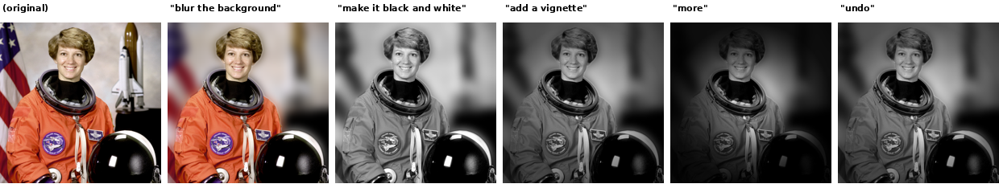
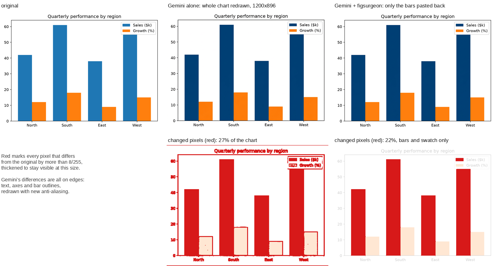
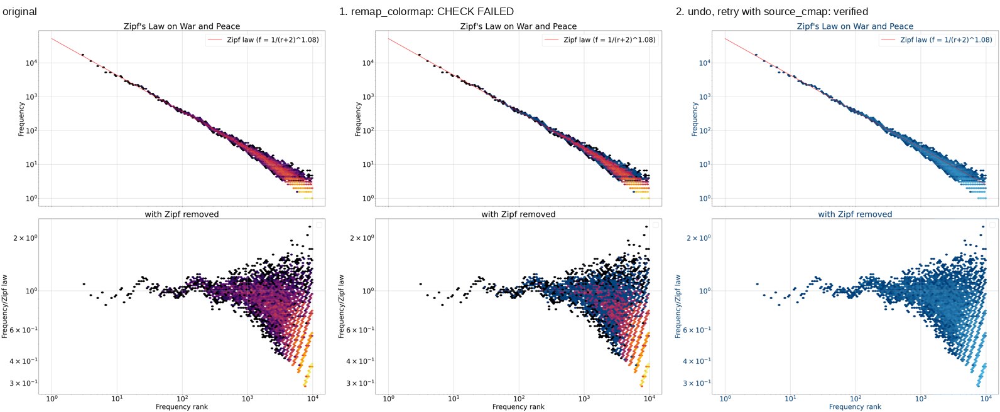
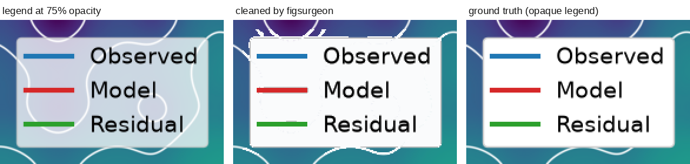
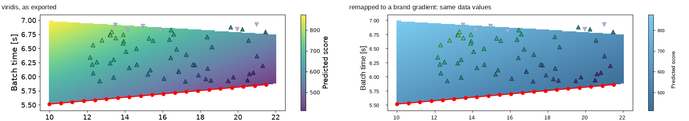
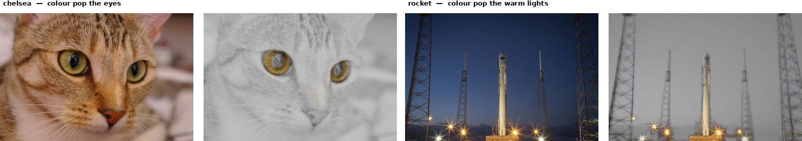
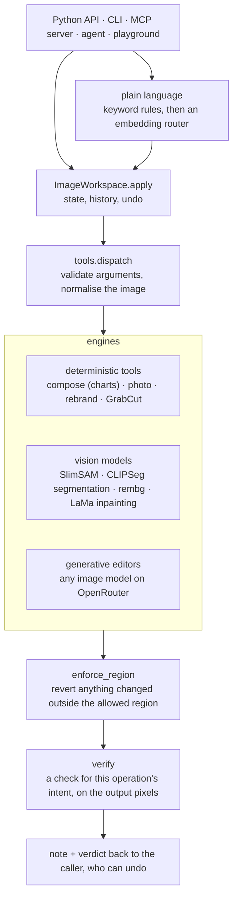
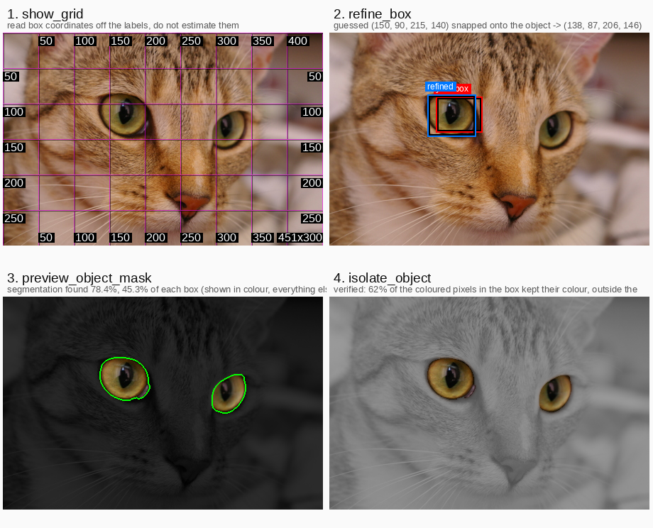

# figsurgeon

Image editing that an agent can drive, and that **reports what actually changed**: every edit
is checked against the output pixels, not assumed to have worked.

> **figsurgeon builds on frontier image models rather than competing with them.** A hosted
> editor (Gemini, GPT Image, or any image model on OpenRouter) is one tool among many here,
> combined with segmentation models (SlimSAM, CLIPSeg), deterministic editing tools, and an
> agent that looks, edits, checks and undoes — with no lock-in to one vendor, for the editor
> or for the agent. How a frontier editor does on its own is [measured below](#how-it-compares-to-a-frontier-image-model).



## Examples

**Wrapping a frontier model.** Asked to make the blue bars navy, Gemini 3 Pro Image does it
well: the result looks right. What it cannot promise is that nothing else changed. It returns
a new image (1200×896 for a 900×675 input, same proportions) with every pixel redrawn, so
text, axes and bar edges are re-anti-aliased: invisible at normal size, but no longer the
original pixels, as the change maps below show. figsurgeon re-registers the model's answer and pastes back only the bars
([`evals/hybrid.py`](evals/hybrid.py)), so the chart keeps its size, everything more than a
pixel from the bars stays byte-identical, and all eight bar heights match the original
exactly. That matters when a figure must provably change only where it was edited.



**An agent catching its own mistake.** Asked to put a figure into a brand palette, the
agent's first `remap_colormap` call only half-worked. The check says so in the note it
returns, the agent undoes, names the source colormap, and the retry verifies. (The same
calls replayed on the current code; black text sits at the dark end of `inferno`, so it
moved to the brand's dark blue too.)

```
remap_colormap {"new_colours": ["#00407A", "#52BDEC"]}
  CHECK FAILED: 106,276 px remapped, 3.5% of the colormap content left on the old scale
  [...] The figure now carries two colour scales at once; a reader cannot tell which one
  a cell belongs to. [...] Call undo and try a different approach
undo
remap_colormap {"new_colours": ["#00407A", "#52BDEC"], "source_cmap": "inferno"}
  verified: 310,110 px remapped, 0.0% of the colormap content left on the old scale
```



**Cleaning a semi-transparent legend.** The contour lines showing through the legend are
removed without touching the legend's own text and swatches. Mean error against the
ground truth drops from 43 to 7.5 (out of 255); a few fragments remain at the top edge.



**Remapping a colormap without changing the data.** The shaded region and its colorbar move
from viridis to a brand gradient, and every pixel still encodes the same value. The scatter
markers are left as they were.



**Colour pop.** Keep one hue and desaturate the rest: the cat's eyes, a launch pad's lights.



## Architecture

Every way in (Python, the CLI, the MCP server, the agent, the playground) goes through the
same path, so every edit gets the same guarantees:



- **One entry point.** `ImageWorkspace.apply(name, args)` holds the image, its history and
  undo, and is what the CLI, MCP server, agent and playground all call. Plain-language
  requests are first turned into a tool call, by keyword rules where they match and by a
  small sentence-embedding router otherwise, so they can only ever name a real operation.
- **Engines are interchangeable tools.** Deterministic operations, segmentation models and
  hosted generative models sit side by side behind the same typed schema (`TOOL_SCHEMAS`).
  The generative editor and the agent's model are both parameters, not a vendor choice
  built into the code.
- **Localisation is enforced, not hoped for.** `enforce_region` puts back any pixel an
  operation changed outside the region it was allowed to touch, and says so in the note;
  `compose_within` does the same for an external editor's output.
- **Every edit is checked.** `verify` runs a check written for that operation's intent
  ("blur the background" must leave the subject sharp), and the verdict comes back in the
  note. A failed check is reported, not silently reverted, so the caller (often an agent)
  decides whether to undo and try again.

## What is interesting here

There are about thirty operations here. Most are standard image operations wrapped for a
model to call. Five are the reason the project exists:

| | What | Where |
|---|---|---|
| 1 | **Value-preserving colormap remap** — swap a continuous colormap (and its colorbar) for brand colours so that each pixel still encodes the same data value, instead of just recolouring pixels | [`rebrand.py`](docs/rebrand.md#rebranding-a-matplotlib-export-rebrandpy) |
| 2 | **Legend / annotation bleed-through cleanup** — remove a semi-transparent box over a plot without removing the plot content visible under it | [legend cleanup](docs/legend-cleanup.md#cleaning-a-semi-transparent-legendannotation-box) |
| 3 | **Per-operation verification with intent-matched thresholds** — each operation has a check for *its own* intent. "Blur the background" is checked for a sharp subject and a softer background, so blurring the whole image fails instead of passing as "the image changed" | [`verify_photo.py`](docs/verification.md) |
| 4 | **A hard mask-composite guarantee** — `compose_within(image, region, edited)` is byte-identical outside `region`, whatever the editor did. That makes it safe to wrap an editor that cannot promise this itself, such as a generative model whose encode/decode changes the whole frame | [`composite.py`](docs/composite.md) |
| 5 | **Perceptual colour selection** — `space='oklab'` follows an object through its shading instead of taking a slice of the hue wheel, and handles neutrals. Selecting the astronaut's orange suit takes 62.7 % of the frame in HSV (her face, her hair, the flag; 2403 fragments) against 25.5 % (154 fragments) in OKLab | [`perceptual.py`](docs/colour-spaces.md#which-colour-space-selects-the-pixels-spacehsv-vs-spaceoklab) |

The rest are conveniences, and the thin wrappers are marked as such where they appear:
geometric operations, text drawing, background removal (`rembg`/U2Net), inpainting
(OpenCV's Telea; LaMa is better), non-local-means denoising, format and EXIF handling, and
box-based segmentation (`cv2.grabCut` on figures and wherever torch is absent, a SAM-class
model on photographs when `figsurgeon[grounding]` is installed; see
[`objects.py`](docs/objects.md#object-level-editing-objectspy)). They are wrapped so that
verification and the composite guarantee apply to every operation.

## The two engines

Both build an editable mask, verify what changed, and accept plain-language instructions:

- **`figsurgeon.compose`** — recolour matplotlib-style figures from the rendered PNG alone
  (exact colours, alpha-blended series, anti-aliased edges).
- **`figsurgeon.photo`** — general edits for photographs (colour pop, background blur,
  vignette, sepia, sketch, brightness/contrast/saturation, crop/rotate/flip). Colours in a
  photo are continuous, so matching uses a soft mask: an HSV hue window by default, or
  perceptual OKLab distance with `space='oklab'`.

The plain-language front-ends (`describe.py` for charts, `photo_describe.py` for photos) are
keyword matchers, not general language understanding; see
[the note on scope](docs/compose-engine.md#describing-edits-in-plain-language).

## How it compares to a frontier image model

[`evals/frontier_editors.py`](evals/frontier_editors.py) gives a hosted model the whole
image and one precise recolour instruction, then measures what changed. On Gemini 3 Pro Image
(September 2026, one call per case, every result looked at 1:1):

| Case | The model | figsurgeon |
|---|---|---|
| Bar chart → exactly `#00407A` | colour exact, all 8 bar heights within 1 px | cannot: `replace_colour` moves hue only |
| Line chart, one series → red | right series and legend, but the line was redrawn 2.5 px higher (0.06 data units) | line stays where it was |
| Three photographs | clean recolours; caught a bumper figsurgeon's mask misses | deterministic, but only as good as the mask |
| A portrait | refused | works |

The model's remaining costs: every return comes back at about 1 MP (a 1920×1440 photo
returned as 1200×896); every background pixel is regenerated, invisibly; and plotted data can
move. `compose_within` keeps the outside of a region exact and at full resolution, but it
inherits the mask's misses and fails on a thin line the model has redrawn beside it.

## Install

figsurgeon is not on PyPI. Install it from GitHub:

```bash
pip install "figsurgeon @ git+https://github.com/franciscoambrosio/figsurgeon"
```

or, to work on it, from a clone:

```bash
git clone https://github.com/franciscoambrosio/figsurgeon
cd figsurgeon
pip install -e ".[demo]"
```

The base package (`numpy`, `scipy`, `Pillow`) covers chart recolouring and the core photo
operations. Everything else is an optional extra:

| Extra | Adds | Needs |
|---|---|---|
| `grounding` | naming a thing by phrase instead of drawing a box (`grounding.py`), and the SlimSAM segmentation backend for `objects.py` | `torch`, `transformers`; CPU is fine, models download on first use |
| `advanced` | background removal, inpainting, denoising (`figsurgeon.advanced`) | `opencv-python-headless`, `rembg[cpu]` |
| `rebrand` | colormap remapping and OCR-based font swap (`rebrand.py`) | `matplotlib`, `pytesseract`, and the `tesseract` binary |
| `agent` | the LLM loop in `agent.py` | `anthropic` |
| `mcp` | the MCP server (`mcp_server.py`) | `mcp` |
| `demo` | sample images for the quickstart and `examples/` | `scikit-image` |

`pytesseract` wraps the `tesseract` binary, which pip cannot install. On Debian/Ubuntu:
`apt-get install tesseract-ocr`. Without it, `rebrand.find_text_regions` and `replace_font`
raise `TesseractNotFoundError`. `figsurgeon doctor` shows which extras are available.

## Quickstart

Needs the `demo` extra for the sample photo.

```python
from PIL import Image
from skimage import data
from figsurgeon import ImageWorkspace

img = Image.fromarray(data.chelsea())            # a cat with amber eyes
w = ImageWorkspace(img)

result = w.apply('isolate_colour', {'target_rgb': [191, 139, 38], 'hue_tolerance': 0.03})
print(result.note)
# isolated 12.8% of the image near (191, 139, 38) (hsv) | verified: target hue retained
# 100% of saturation, the rest of the frame retained 2%

out = w.image                                     # the edited image
```

`w.apply(...)` runs the edit and checks it against that operation's intent in the same call.
The "verified: …" text is a measurement of the output pixels. A failed check is not
reverted automatically; call `w.apply('undo', {})` to take the edit back
([why](docs/agent-loop.md)).

## Editing with a model: look, edit, verify, undo

This is the layer the package is built for. A vision model can see the picture, which makes
it better than a keyword parser at "the orange of her shirt", but it is weak at absolute
pixel coordinates, and most operations here take a box. A misplaced box is easy to make and
hard to notice: without a check, the next call edits the wrong pixels and reports success.
Three parts address that:

1. **Looking tools (`locate.py`)** — `show_grid`, `preview_region`, `refine_box`,
   `preview_object_mask` / `preview_colour_mask`, `zoom`. They return an image to inspect
   and change nothing:

   

2. **`ImageWorkspace`** — state, undo, and automatic verification:

   ```python
   from figsurgeon import ImageWorkspace
   w = ImageWorkspace(img)
   w.apply('show_grid', {})                                    # look; nothing recorded
   w.apply('recolour_object', {'box': [...], 'to_rgb': [30,60,180]})
   w.apply('undo', {})                                         # that box was wrong
   print(w.summary())                                          # every edit + its verdict
   ```

   Every edit is checked against the operation's intent and the verdict is returned in the
   tool note. A failed check is reported, not reverted; `undo` makes acting on it cheap.
3. **Several regions in one call, graded one at a time** — `isolate_object(boxes=[...])` and
   `recolour_object(boxes=[...])` take a list, and each box gets its own verdict.

**A wrong box still passes every check.** Nothing measurable distinguishes "edited the region
you asked for" from "you asked for the wrong region"; only looking does. That is why the
looking tools exist. With `figsurgeon[grounding]` installed, many requests need no box at
all: `photo_describe` resolves "make the sky pink" or "keep the woman in colour" to a mask
directly, in about 0.6 s.

More detail, with the measurements behind each part: [`docs/agent-loop.md`](docs/agent-loop.md).

## Other ways to use it

- **MCP server** — exposes the operations as tools for a model; see [`docs/mcp.md`](docs/mcp.md).
- **Command line** — `figsurgeon doctor` checks your install and extras;
  `figsurgeon edit photo.jpg "make the sky blue"` applies one instruction and exits with
  status 2 if the result fails its check.
- **Playground** — a local web page for editing a photo by box or in plain language, with the
  verdict shown next to the picture: `python -m playground.server` from the repo root, then
  open <http://127.0.0.1:8420/>. Localhost only.

## Repository layout

| Path | Contents |
|---|---|
| `figsurgeon/` | the package |
| `examples/` | runnable demos; each writes its output to `examples/output/` |
| `docs/` | documentation, one page per topic ([index](docs/README.md)) |
| `tests/` | the test suite; fixtures in `tests/data/` |
| `evals/` | evaluation scripts; each regenerates its own comparison sheets ([overview](docs/evals.md)) |
| `specs/` | an annotated `FigureSpec` for the chart engine |
| `playground/` | the local web playground |

Run the tests with `pip install -e ".[advanced,demo,rebrand]" pytest` and then
`python -m pytest tests/`.

## Documentation

- [`docs/agent-loop.md`](docs/agent-loop.md) — the look/edit/verify/undo loop
- [`docs/evals.md`](docs/evals.md) — the evals and what they found
- [`docs/photo-demo.md`](docs/photo-demo.md) — the five-photo demo
- [`docs/colour-operations.md`](docs/colour-operations.md) — "more"/"less", named colours vs.
  region references
- [`docs/colour-spaces.md`](docs/colour-spaces.md) — `space='hsv'` vs `space='oklab'`
- [`docs/rebrand.md`](docs/rebrand.md) — `rebrand.py`: colormap remap and font swap
- [`docs/grounding.md`](docs/grounding.md) — `grounding.py`: naming a thing instead of drawing a box
- [`docs/session.md`](docs/session.md) — `ImageSession`: multi-turn plain-language editing
- [`docs/legend-cleanup.md`](docs/legend-cleanup.md) — cleaning a semi-transparent legend box
- [`docs/composite.md`](docs/composite.md) — `compose_within`: the mask-composite guarantee
- [`docs/verification.md`](docs/verification.md) — `verify_photo.py` / `evals/eval_suite.py`
- [`docs/advanced.md`](docs/advanced.md) — `figsurgeon.advanced`
- [`docs/objects.md`](docs/objects.md) — `objects.py`: object-level editing
- [`docs/compose-engine.md`](docs/compose-engine.md) — the chart engine's three layers
- [`docs/limits.md`](docs/limits.md) — known limitations
- [`docs/mcp.md`](docs/mcp.md) — the MCP server and the CLI

## Licence

Copyright 2026 Francisco Ambrosio. The code is under the [Apache License 2.0](LICENSE).

The eval images are **not** covered by that licence. They are other people's photographs and
figures from Wikimedia Commons, each under its own terms (several are CC BY-SA, which
applies to derivatives), and the sheets and masks committed under `evals/segmentation_models/`
and `evals/object_completeness/` are derivative works of them. Attribution for every one is in [`evals/CREDITS.md`](evals/CREDITS.md).
The legend example above is built on
[*Ackley 2d*](https://commons.wikimedia.org/wiki/File:Ackley_2d.png) by Balluwun-enjoyer,
[CC BY-SA 4.0](https://creativecommons.org/licenses/by-sa/4.0/); `docs/images/legend_cleanup.png`
is under the same licence. The agent example is built on
[*Zipf's law on War and Peace*](https://commons.wikimedia.org/wiki/File:Zipf%27s_law_on_War_and_Peace.png)
by Cosmia Nebula, [CC BY-SA 4.0](https://creativecommons.org/licenses/by-sa/4.0/);
`docs/images/agent_undo.png` is under the same licence. The bar chart is synthetic, and the
other example photographs are scikit-image's sample images (public domain or CC0).
