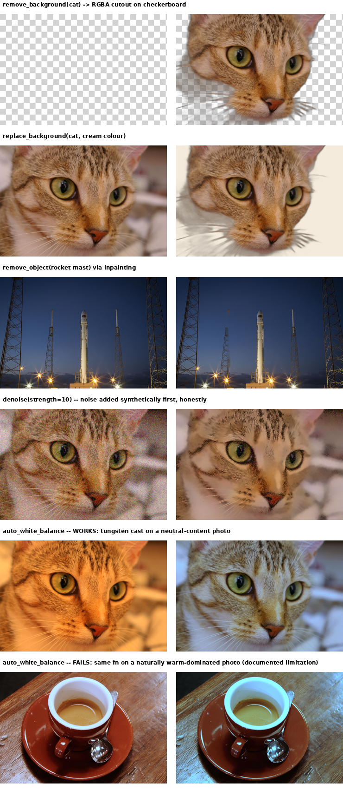

[← back to README](../README.md)

## `figsurgeon.advanced` — thin wrappers around other people's models

These functions wrap existing models rather than reimplement them: background removal is
`rembg` (U2Net); inpainting is OpenCV's Telea, which LaMa beats; denoise is OpenCV's
non-local means. What figsurgeon adds is that each call is verified and each result
composited under the same guarantees as everything else in the package.

`photo.py`'s colour masking can only separate regions that differ in *colour*. Anything that
needs to know *what an object is* — not what colour it is — needs something more.
`advanced.py` adds three tiers, and its docstring states which tier each function is in:

| Function | How | Needs |
|---|---|---|
| `remove_background`, `replace_background` | U2Net neural network, via `rembg` | model download (~176 MB, first use only) |
| `remove_object` | OpenCV Telea/NS inpainting | nothing extra, works offline |
| `denoise` | OpenCV non-local means | nothing extra, works offline |
| `auto_white_balance` | grey-world colour correction | nothing extra, works offline |

Install with `pip install "figsurgeon[advanced]"`. The base package imports fine without
these — `advanced.py` raises a clear `ImportError` naming the actual PyPI package if you
call one of its functions without the extra installed, rather than failing opaquely or
forcing everyone to carry OpenCV and a 176 MB model just to recolour a chart.

`examples/demo_advanced.py` writes the panels of the grid below to `examples/output/`: background removal + replacement on
the cat, an inpainted rocket mast removed from open sky, denoising on synthetically-noised
input, and a white-balance success and failure shown side by side:

- `auto_white_balance` works on a photo with real neutral content (the cat's white fur, grey
  background) under a synthetic tungsten cast — the correction restores natural colour.
- `auto_white_balance` fails on the coffee photo, which is naturally warm-dominated (brown
  cup, wood table). Grey-world assumes the scene average is neutral grey; that's false here,
  so correcting toward it drags the whole photo cyan.

Nothing here does *instance* segmentation — "make the car red" or "remove the person on the
left" in a street scene needs detecting which pixels belong to *which* object, not just
subject-vs-background. `remove_background`'s mask separates one subject from its background,
not multiple named objects from each other or from a busy scene. `objects.py` (next section)
closes part of this gap *given a box*; it still cannot find the object for you.

