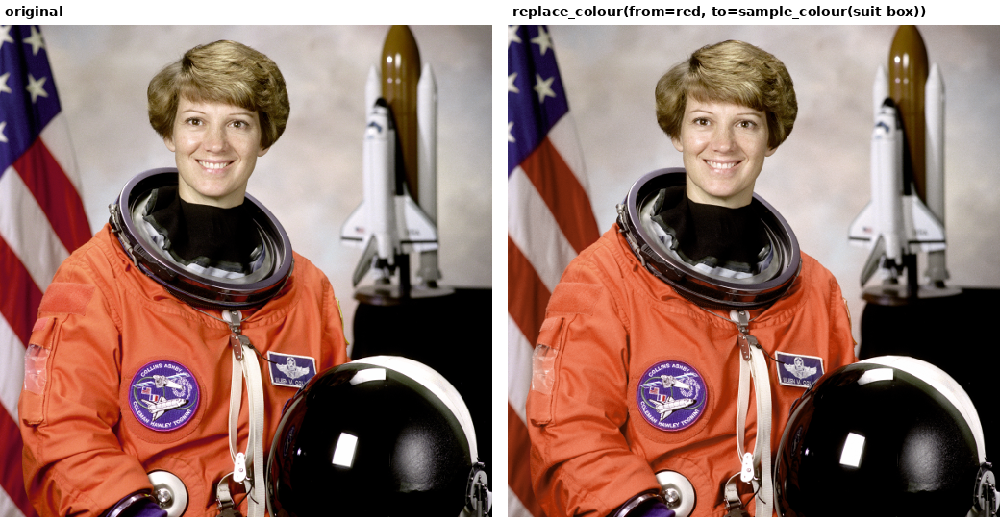

[← back to README](../README.md)

## "more" / "less" on isolate_colour and replace_colour

`isolate_colour` and `replace_colour` support refinement: "more" after "colour pop the red"
scales a per-function default. `isolate_colour` injects and scales `flatten` (more = a
bolder, more stylised grey-out); `replace_colour` injects and scales `hue_tol` (more = a
broader match). Both round-trip correctly under repeated more/less, same as every other
refinable parameter.

## Colour replacement: named colours vs. region references

`photo.replace_colour(img, from_colour, to_colour)` hue-shifts matched pixels toward a
target hue while preserving each pixel's own saturation and value, so a red flag stripe
recoloured orange still has its folds and shading, rather than becoming a flat orange blob.
On a real photo (astronaut), brightness in the recoloured region was identical before and
after (0.590 -> 0.590), while hue moved from 0.065 to 0.038, matching the sampled target
almost exactly.

`"replace the red with orange"` parses directly. `"replace the red with the orange of her
shirt"` cannot: "the orange of her shirt" references a region of the photo, not a colour
name, and resolving it needs to know where the shirt is, which needs object detection this
package doesn't have. The parser recognises this shape (a colour word immediately followed
by "of/from/in <something>") and raises with the actual next step, rather than silently
guessing a generic orange:

```python
suit_colour = photo.sample_colour(img, box=(140, 250, 220, 320))   # a real crop of the shirt
photo.replace_colour(img, from_colour=(200,30,30), to_colour=suit_colour)
```

In a chat, this happens automatically: the calling model looks at the photo, picks the box,
samples the real colour, and calls `replace_colour` directly — the region reference gets
resolved by something that can see the image, not text pattern matching.
`examples/demo_replace_colour.py` shows both halves: the parser failure, and the resolution.



"Orange" is both a valid colour name and the first word of a region reference ("orange of
her shirt"). The captured word alone can't tell those apart — `"replace the red with
orange"` and `"replace the red with the orange of her shirt"` both capture "orange". What
settles it is whatever comes right after the match: `of/from/in/on` signals a region
reference. A passive-voice pattern is also matched — "the red replaced by orange" puts the
colour before the verb, which an active-voice-only pattern would miss, falling through to a
generic error instead of the specific one.

