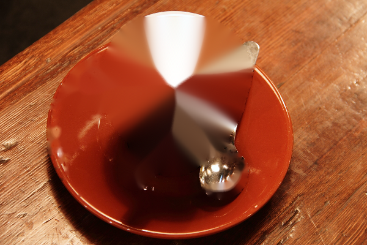

[← back to README](../README.md)

## Object-level editing: `objects.py`

`photo.py` separates pixels by colour; `advanced.remove_background` separates one subject
from its background. Neither helps with "recolour the suit, not the flag" when suit and flag
share a box, or "isolate the cat" when the cat's own fur is the same grey as the wall behind
it. `objects.py` adds a third primitive: given a rough box, it returns an object-shaped
mask, not a hue band or a whole-subject silhouette.

**Two backends; which one is right depends on the picture.**
`evals/segmentation_models/` measures four segmenters against eight hand-drawn boxes on
photographs, and `nielsr/slimsam-77-uniform` (Apache-2.0, ~40 MB, ten lines through
`transformers`) is best or near-best on every one. It is what `backend='auto'` uses for a
photograph when `figsurgeon[grounding]` is installed — the same two packages the text
grounding needs, so it is one extra rather than two.

| | GrabCut (2004, OpenCV) | SlimSAM-77 |
|---|---|---|
| the astronaut's *other* helmet, inside the suit box — lower is better | 75.4% of it | **10.4%** |
| the hand gripping the umbrella in a studio portrait — higher is better | 47.9% | **69.0%** |
| the flower box rectangle filled (it found the rectangle, not the seed head) | 90.0% | **72.3%** |
| cost at 0.4 / 1.5 / 4.3 MP, same box, same photograph | 1.6 / 10.1 / **27.9 s** | 2.8 / 2.8 / **2.8 s** |

A SAM encoder always sees 1024×1024, so the cost is flat in image size and the mask is the
same at every scale. A slow object call is not told to "resize first" on that backend
(`workspace.SLOW_CALL_SECONDS`), and a box measured on a downscaled preview is not a failure
class.

**Eight boxes drawn by hand, on photographs this package had never seen: seven come back as
the object.** With GrabCut alone, one of eight boxes returned the object; the rest took the
sky, a patch of cheek, a blob of a plate. With `backend='auto'` on eight fresh Commons
photographs (`evals/segmentation_models/eight_boxes.py`, which commits the overlays it
writes): a dog, a kingfisher with both wings, a backpack with its handles, a whole
motorcycle including spoked wheels and mirror against a railing at the same distance, a boat
that is mostly rigging at 2 % of the frame, a terrace chair, a horse. Graded with the
caller's words, those edits read six verified, two abstentions, no failures.

**The one that fails is the guitar, and no box fixes it.** The mask takes the player's
fretting hand and forearm along with the instrument, because the arm lies across the neck
and every box around the guitar contains it — the "a second object is inside your box"
limit. Recoloured, the arm goes blue. Nothing in the package measures that: completeness
asks whether all of the object changed, not whether only the object did.

**The result reverses on flat-colour figures**, which is what this package is named after.
Given a loose box on a chart, SlimSAM returns the white page inside the box and leaves the
bar out — IoU 0.00 against GrabCut's 1.00 on three of four constructed-truth cases
(`evals/segmentation_models/synthetic.py`). There is no mask-quality check to catch that, so
`backend='auto'` routes on a flatness statistic whose two groups do not overlap across 20
images (charts and rendered figures 0.89–1.00, photographs and screenshots 0.00–0.43):
figures to GrabCut, photographs to SlimSAM. Neither backend is deprecated, either can be
asked for by name, and with no torch installed everything falls back to GrabCut rather than
refusing. `tests/test_segmentation_backend.py` locks in the routing, the fallback, and that
the box guarantee (clipped to `box`, nothing leaks outside it) holds under both backends.

**The edit follows the object out of the box.** Clipping the mask to the rectangle keeps the
promise that a localised edit changes nothing outside the region you named, but on a real
photo it can cut an object in half: the astronaut's suit turns blue and her sleeve stays
orange, with a hard seam down the line the caller happened to draw, under the word
"verified". Measured across the eight eval boxes, clipping discards 1.5–19 % of each mask —
the red car loses its wheels. Instead, the part of the mask connected to something inside
the box is kept wherever it goes, and the tool states the region it actually touched;
`composite.enforce_region` holds the edit to that region instead of to the bare box, and the
note says so ("the object continued past the box: 12 % of it was outside"). A blob that
never touches the box is still dropped, so the box still decides which thing is edited — it
just no longer decides where that thing ends. `follow_object=False` restores clipped
behaviour.

**No box fixes a bad box — pointing at the thing works instead.** A rectangle around a
rocket on a launch pad is mostly sky, and every segmenter tried returns the sky: GrabCut,
SlimSAM, SAM 2.1-tiny and SAM ViT-B alike, and all three of SlimSAM's own candidate masks.
That is what the prompt says, not a model problem. The object tools take
`points=[(x, y), …]` (or `point` as a tool argument) instead of a box: two points on the
rocket body return the rocket, taking 0.0 % of a sky patch that the box-driven mask takes
80 % of.

| "make the rocket red" | what you get |
|---|---|
| from a box around the rocket | the sky, in the shape of the sky |
| from two points on the rocket | the rocket |

A point is not a correction to a box: measured on that photograph, prompting with the box
and a point returns a mask indistinguishable from the box alone (50.7 % of the frame against
49.5 %, the same sky either way), because this checkpoint's box prompt dominates. Passing
both raises, rather than silently dropping the point the caller was relying on. Points need
the SlimSAM backend — GrabCut segments from a box only, and says so rather than substituting
one.

**Say what you meant, and the edit gets checked against it.** The object tools can report
containment — "0 px changed outside the target region" — which is true of a recolour that
took the sky instead of the rocket, and true of one that recoloured half the suit. Measuring
how much of the object changed is harder: inferring the object's extent from the box or from
the edited pixels themselves ends up grading the box instead.

`subject` is the evidence that does not: your own words, resolved to a region by CLIPSeg.
Pass it to `recolour_object` and the verdict changes from "nothing leaked, look at it
yourself" to a number:

```python
ws.apply('recolour_object', {'box': [60, 180, 420, 512], 'to_rgb': [40, 80, 200],
                             'subject': 'the suit'})
# verified — 89% of 'the suit' was recoloured

ws.apply('recolour_object', {'box': [30, 30, 560, 300], 'to_rgb': [40, 80, 200],
                             'subject': 'the rocket'})
# NO completeness verdict, and look at this edit: only 1% of what changed is inside
# 'the rocket'. The box and the words disagree about which thing this is
```

That second one is the package's worst known failure, and without `subject` it comes back
"verified".

**The plain-language path is checked too.** `recolour_subject` — what "make the horse
purple" parses to — paints the region a phrase resolves to, with no box anywhere. It has no
check of its own: the two outcomes it produces look nothing alike. "Make the horse purple"
gives a clean horse; "recolour the guitar blue" gives a blue slab across the guitar, both of
the player's arms and part of his shirt. Nothing tells the caller which one they have.

**Audited over 46 (photograph, phrase) pairs, and scoped as a result.** Bands calibrated on
16 single compact objects do not survive contact with the rest of the language: good masks
run 0.42–0.95 and wrong ones 0.13–0.78, overlapping across a third of the scale. Three kinds
of request are declined outright, because the corroborating measurement is structurally
unable to answer them — a segmenter prompted with one box cannot reproduce a mask made of
several separate things ("the people walking"), it segments whole objects so a part scores
low whatever the truth ("the horse's tail"), and a skeletal region matches no blob either
way. Each declines with the reason. Peak phrase confidence was tried as a fourth signal and
dropped: good 0.68–0.97 against wrong 0.69–0.93, no separation at all.

What can be checked is not whether the words found the right object — the mask and any
measurement of it would share their evidence — but whether a second model, given no words at
all, agrees about the shape: the painted region is handed to the segmenter as a box, and its
mask compared with the region. Measured over sixteen photographs, that reads 0.79–0.95 where
the phrase mask is a usable object and 0.22 / 0.49 / 0.65 on the three where it is not (a
boat whose region is the filled silhouette, the guitar, and a chair whose region takes in
the floor). Agreement is not confirmation — two models can be wrong together — but
disagreement is a real signal, and the guitar fails. One audited case shows both wrong
together: "the fence" resolved to patches of grass and the segmenter agreed with that blob,
IoU 0.78, a pass on a mask of the wrong thing — which is why the passing verdict states that
agreement is not the same as the right object.

**The phrase is resolved on the box, not the whole frame**, and that matters. CLIPSeg sees a
fixed 352x352 input whatever it is given, so an object small in the frame is tiny in what
the model reads, and a thin object at that size comes back as its filled silhouette. A
correct recolour of a sailing boat (hull, mast, rigging, 2 % of the frame) was graded
against a region that included the sky enclosed by the rigging, and reported as "66 % of it
kept its original colour" — a check failing correct work, the worse direction. Resolving on
the box plus context puts the object at a readable size — that edit reads 0.61 and abstains
instead of failing, and the calibration improves rather than trading (median error
0.055 → 0.032).

**The words are asked what this is, not which one it is.** Resolving on the box has a cost:
inside a crop holding one sheep, "the sheep on the left" can only be read as the left half
of that sheep. Positional wording is not an edge case — with three identical things in the
frame and no object detection, it is how a caller says which one they drew the box around.
Measured over eleven instances on four photographs that each contain several of one thing
(three sheep behind a wire fence, three identical bicycle saddles, three pedestrians, two
identical chairs, every mask confirmed to be the object): the caller's own positional phrase
keeps a verdict on 6 of 11 correct edits against 10 of 11 for the bare noun, and each of the
four losses reads "the box and the words disagree about which thing this is — one of them
is wrong", about an edit where both were right. It buys nothing in the other direction
either: the same eleven masks cut in half are FAILED 7 times by the positional wording
against 8 by the bare noun.

So a locator is dropped before the phrase is resolved — "the middle sheep" is asked as "the
sheep" — while an attribute, which says what the thing is, is kept ("the red car" is asked
as written). The box already chose which one; a position could only be checked against the
whole frame, which is the thing this avoids. The note says which half of the phrase was
checked, so a caller is never told their words were verified when only part of them was.
Both directions are in `evals/instance_phrases.py`: the positional and bare readings are
identical on all 22 rows, 10 PASS on correct work and 8 FAIL on the half-recoloured ones.

The measure is calibrated, not fitted: recolour a known 30 / 50 / 70 / 85 / 100 % of an
object and it tracks the known fraction to a median of 0.03 across nine photographs. The
thresholds state a meaning — verified above 85 %, failed below 60 % ("two fifths of it kept
its original colour"), and no verdict in between, where no threshold could honestly decide.
It also does not grade the box: on the red car, drawing the box 30 % larger moves it
0.94 → 0.82, and 0.07 of that drop is real, because the looser box leaves part of the object
genuinely unrecoloured.

**The colour-pop is graded the same way.** `isolate_object` keeps what is inside the box in
colour and greys the rest of the frame, and a check that only confirms "something in the box
kept its colour, and the rest of the frame lost it" is also true of the inverse edit — the
background inside the box kept in colour and the object greyed — which is what a segmenter
that takes the sky instead of the rocket produces. Measured over ten photographs x three
variants (`evals/object_verdicts.py`, every mask looked at first): blind, 8 of 10 inversions
and 9 of 10 half-isolations come back verified. With `subject`, none of either does — 10 of
10 correct isolations still pass, the half-isolations read 9 FAIL / 1 no-verdict, and the
inversions 3 FAIL / 7 no-verdict, each saying that the box and the words disagree about
which thing this is.

**The cutout is checked the same way.** `extract_object` returns an RGBA image, and nothing
about one says what was kept: the only things measurable without words are an empty cutout
and one that kept the whole frame. A cutout of the background inside the box is neither. The
alpha channel is the mask, so it is graded against the words by the same measure — across
the same ten photographs, correct cutouts read 9 PASS / 1 no-verdict, the half ones 10 FAIL,
and the inversions 10 no-verdict, none of them verified.

The named region is narrowed to the pixels that had colour, because a colour-pop cannot keep
colour where there was none, and grading the white frame of a deck chair as "left behind"
would fail correct work. The verdict is stated in the operation's own words — "93 % of 'the
sheep' kept its colour", not "was recoloured" — so a true number never sits under a false
sentence.

**It abstains rather than guesses:** when the words match nothing ("the flower centre" peaks
at p=0.29 on a flower macro), when they cover the whole region (the chelsea box lies wholly
inside the cat, so "how much of the cat changed" is just "how much of the box changed"),
when the named thing is in the picture but not where you edited, and when the edit and the
words disagree about which thing this is — the rocket above, and a coffee box whose
segmenter recoloured the saucer while the caller said "the cup". In that last case it cannot
say which of the two is wrong, so it says so instead of ruling.

Moving each case's box off its object gives eight constructed wrong boxes, and none of the
eight comes back verified — three score 0.00–0.02 where the same box on its object scores
0.87–0.99, four are caught because the named thing is absent from the region that changed,
and one is silent because its phrase matches nothing anywhere. That last one is the real
limit: where the words fail, this check says nothing and containment is all that is left.
Without `subject`, or without the grounding extra, the behaviour is unchanged.

```python
from figsurgeon import objects
from skimage import data
from PIL import Image

img = Image.fromarray(data.astronaut())
# the box covers the suit AND a corner of the flag's red stripes (measured: a red stripe
# pixel at x=69,y=180 falls inside this box) -- replace_colour (hue-based) would recolour
# both; recolour_object (spatial) only recolours the object segmented INSIDE the box
out, coverage = objects.recolour_object(img, box=(60, 180, 420, 512), to_rgb=(30, 60, 180))
```


The flag stripe measured RGB (135,17,19) before and after — byte-identical. The suit moved
from (218,89,48) to (39,78,236), with `preserve_shading=True` scaling the target colour by
each pixel's own luminance, so folds and highlights survive rather than flattening to a
solid fill (same technique as `photo.replace_colour`). The black helmet held in the
foreground sits inside the same box: 99.8% of it came back blue under GrabCut, 0.4% under
SlimSAM — the clearest illustration of the limit below, since the segmenter is guessing
which thing in the box you meant.

`erase_object(img, box)` segments the object then inpaints it out, and returns a warning
above ~8% frame coverage: a rocket mast at 1.9% of the frame erases cleanly (~3,400 pixels
changed at an 8/255 gate, tight to the mast, sky reads as clean afterward); a coffee cup at
27% of the frame smears visibly (a radial streak pattern), because inpainting has no
information about what was actually behind a large object. Both results are shown in
`tests/test_objects.py`, not just the flattering one.

| Success: mast erased (1.9% of frame, no warning) | Disclosed failure: cup erased (27% of frame, warning fires) |
|---|---|
|  |  |

**Two real, disclosed limits:**
- `segment_object` only knows box-interior vs. box-exterior, not "which thing in the box did
  the caller mean." On the astronaut photo, a box drawn around the suit also catches the
  bottom corner of a second helmet held in the foreground, because that helmet sits inside
  the same box. A tighter box that excludes the other object is the fix; there is no
  parameter here that resolves it.
- `recolour_object`'s dispatch handler warns when the returned coverage exceeds 95% of the
  box — on GrabCut that reliably means it gave up and kept everything, not that it found a
  clean object. Verified on `chelsea` with a box that has almost no background margin:
  coverage 95.9%, and the warning fires. That threshold is GrabCut's and is not re-fitted
  for SlimSAM, whose coverage runs 0.42–0.82 over the eight eval boxes and 0.15–0.86 over
  sixteen deliberately-wrong ones, against 0.90 for the one case seen to return the
  rectangle itself. Coverage does not separate those. The coverage is reported in the note
  either way, warning or not.

**Verifying an object edit: containment is checked, completeness is not.** `ImageWorkspace`
runs `verify_photo.check_unchanged_outside` on every object edit, which confirms nothing
leaked outside the box — but for a segmentation-backed tool that check passing is not the
same as the segmentation having found the object. Eight boxes drawn by hand around an
obvious subject and segmented: the rocket box recoloured the sky, the sushi box a blob of
the plate's centre, the cat box a patch of cheek, the whale box a rectangle of sky above the
fluke, the poster box the woman and the yellow background behind her. Every one of those
reports "verified: 0 px changed outside the target region" — true, and misleading, because
nothing leaked out of a box that also never held a clean object.

The missing half is completeness — how much of the object changed. Four candidate measures
were tried and dropped (`verify_photo.check_object_recoloured`'s docstring, measured in
`evals/object_completeness.py` on six photographs, a complete recolour that must PASS
against a half-done / 51%-sliver / no-op recolour that must FAIL):
1. Same-colour leftovers modelled by nearest neighbour among the changed pixels: complete
   recolours score 0.28-0.94, half-done ones 0.27-0.49 — no margin at all.
2. The same with a coarser colour model: separates the boxes it was tuned on, then collapses
   when the same complete recolour is drawn in a 30% larger box (0.77 → 0.48 on the car).
3. Boundary flatness (how much of the mask edge cuts through same-colour material on both
   sides): ranks a correct flower recolour (0.53) worse than a genuinely half-done portrait
   (0.69).
4. An independent extent estimate from `rembg`'s subject mask: complete recolours 0.44-0.99,
   half-done ones 0.28-0.54 — overlapping, because rembg's subject and the caller's object
   are not the same region (the astronaut box means the suit; rembg's subject includes the
   black helmet held in front of it).

All four are dominated by the same unknown — how much of the box is not the object, and how
much of that resembles it — which is the object's extent, the thing that is missing. So
`check_object_recoloured` claims no completeness verdict. What it reports is what is
decidable: whether anything inside the box changed at all (a no-op recolour fails this), and
what fraction of the box changed, with no judgement on whether that fraction is the whole
object. `workspace.verify`'s note says so directly: "Nothing leaked outside the box — that
is all this confirms. Whether the segmentation found the object, and all of it, is not
checked and cannot be measured from the output alone: call `preview_object_mask` and look."

**What is decidable, and checked: whether the recolour flattened the object.**
`recolour_object(preserve_shading=False)` writes one colour into the mask, so fur, folds and
reflections come back as a silhouette, and every other check passes it, because 100% of the
object did change colour. A model driving the loop produced exactly that (`evals/agent_loop/`,
`two_dogs`: a flat tan blob where a dog's head was) and got "verified". `verify_photo.
texture_kept` is the median ratio of local standard deviation, after against before, over the
edited pixels that had texture to lose; below 0.5 the check fails outright and says how much
is gone. Measured in `evals/recolour_vs_generative.py` over 8 photographs x 4 arms: every
flattened object reads 0.00 (a constant region has no local variance), every correct
recolour reads 0.71-1.26 whichever path produced it, and blending a correct recolour toward
the flat one by *t* reads *(1-t)* on all eight, so the number states how much was lost
rather than merely ordering. A flat painted surface with no texture to lose — a door, a
chart bar — is gated out rather than failed.

It cannot see a replaced object: a generative fill told to put a different thing in the same
mask keeps texture of its own (0.08-1.23) and inherits the silhouette the mask fixes. That is
the open gap.

**A real bug.** `cv2.grabCut`'s k-means initialisation reads OpenCV's global RNG, which is
not reset between calls. Five identical back-to-back `segment_object` calls on the same
image and box returned coverage 0.150, 0.150, 0.0, 0.150, 0.150 — the 0.0 run was not a
different segmentation, it was k-means landing in a degenerate initial state. In a
multi-turn `ImageSession`, this would silently corrupt an edit that had worked moments
earlier on identical input. Fixed with `cv2.setRNGSeed(0)` before every `grabCut` call;
deterministic across ten repeated calls afterward.

`box` is approximate, the same convention as `remove_object` and `clean_transparent_box` —
this module does not locate the object for you. `tests/test_objects.py` locks in both guards
(a box covering ≥98% of the frame raises `ValueError` rather than an opaque OpenCV
assertion; `erase_object`'s size warning) and the flag-stays-red case above.

