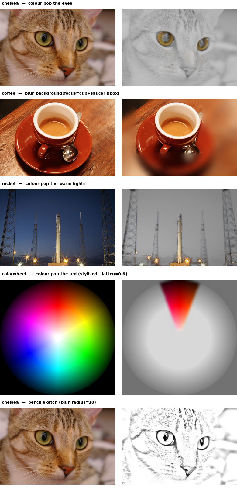

[← back to README](../README.md)

## Photo demo

Five openly-licensed photos (CC0 / public domain, bundled with `scikit-image`'s sample
data — see `examples/demo_photos.py`), each showing an effect actually suited to that photo:

| Photo | Effect | Why this subject |
|---|---|---|
| chelsea (cat) | colour pop the eyes | real hue separation (amber ~0.11 vs fur ~0.065) |
| coffee | `blur_background(focus=cup+saucer bbox)` | simulated shallow depth of field |
| rocket | colour pop the warm lights | warm lights (~0.10) vs blue sky (~0.61) |
| colorwheel | colour pop the red, `flatten=0.6` | precise hue-window isolation, stylised background |
| chelsea (cat) | pencil sketch, `blur_radius=10` | real tonal gradients, unlike a flat texture |

Run `python examples/demo_photos.py` to regenerate the panels of the grid below (written to `examples/output/`).

**Notes on choosing the demo photos and settings:**

- **Subject choice matters more than parameter tuning.** An instruction only works on a photo
  that actually has the property the effect needs. `coffee`'s cup and saucer share almost the
  same hue (measured: 0.079 vs 0.067) — no threshold separates them, so "colour pop the
  saucer" doesn't work on that photo regardless of tuning; `blur_background` doesn't need hue
  separation and works there instead. Measure the relevant property
  (`figsurgeon.photo._to_hsv` on a cropped region) before picking which effect to demo on
  which photo.
- **"Grey" needs a `flatten` parameter, not just accurate desaturation.** True per-pixel
  luminance is "correct" but looks wrong on a photo with a naturally bright region — the
  colour wheel's centre is genuinely near-white in the original, so accurate desaturation
  reproduces white there too, and the before/after barely reads as different. `flatten`
  (0=true luminance, 1=flat mid-grey, default 0.5) blends toward the stylised "magazine
  colour-splash" look most people actually mean.
- **The sketch effect needs a photo with real shading.** Brick is a flat, repetitive texture
  with almost no tonal gradient; no blur radius makes it look good. The same code on a photo
  with real shading (the cat) produces a clean result at the same settings.

