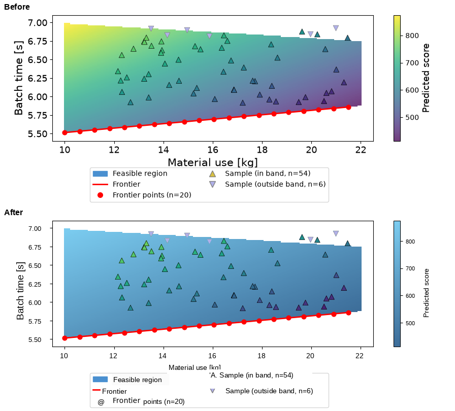

[← back to README](../README.md)

## Rebranding a matplotlib export: `rebrand.py`

A different kind of problem from everything else in this package: not separating or
recolouring a discrete series, but re-theming a whole chart — font, label size, and colour
palette — to match a brand style guide, from the rendered PNG alone. Tested against a real
chart: a viridis heatmap + colorbar, DejaVu-font labels, matching Arial / `#00407A` /
`#52BDEC`.

Run on three published figures nobody here made (`evals/chart_remap.py`), which surfaces two
defects invisible at figure scale and plain at 1:1:

* *The anti-aliased edge keeps the old palette.* A gridline or contour drawn over a colormap
  has border pixels that are blends of the line and the colour under it; those are not in
  the colormap's LUT, so a naive match skips them. Every white gridline on a viridis heatmap
  comes back green, yellow and purple (19,160 px, 7.7 % of the box) and every white contour
  line comes back haloed in yellow (30,535 px, 4.3 %). The edge is solved as
  `C + t*(O - C)` against the colormap colour beside it and re-mixed at the same `t`, which
  takes those to 400 and 1,512 px — the remainder being line intersections, where two
  overlays meet and a two-way blend does not describe the pixel. It costs 0.03 s.
* *A band of values does not match at all.* A published figure's `jet` is not necessarily
  matplotlib's `jet`; a slice of the gradient then sits outside `match_tolerance` and
  survives, so the output carries two colour scales at once. Widening the tolerance would
  recolour content that was never in the colormap, so this is checked rather than fixed —
  see below.

**The box is optional, and leaving it out is usually right.** This operation selects by
colour — a pixel is remapped because it matches the source colormap, not because of where it
sits — so a box only restricts where that selection can apply. Requiring a box per region
(plot area and colorbar as separate boxes) produces exactly what you would expect: a
re-themed heatmap published with its key still in the old colours, under the word "verified",
because every measurement the check makes is taken inside the box it was given. `box`
defaults to the whole figure — the cells, the colorbar, a second panel, an inset and a scale
down the side all carry the same colormap and all go together — and passing one means
protect the rest. The check also scans outside the box and says what it finds there, as a
fact rather than a verdict.

**The edge pass does not assume the overlay is white or black.** Assuming that is true of a
ramp crossed by grey gridlines or a magenta annotation line, but both edges would come
through untouched, keeping the old palette. The overlay's colour is measured from the
overlay itself — the nearest pixel of its core — which also handles several different
overlays in one figure, and overlays that cross.

**`remap_colormap` is verified, not just contained.** `check_unchanged_outside` — nothing
changed outside the box — is true of every one of the failures above, so it is not enough on
its own. `verify_photo.check_colormap_remapped` measures two things: how much of the box's
colormap content is still on the old scale, and whether each colour still encodes the value
it did. It separates cleanly on real figures: 0.0 % on the two that come out right, 3.1 % on
the banded one (FAILED, naming the band), 94.4 % when the caller names the wrong source
colormap (FAILED, saying so rather than blaming a band).

```python
from figsurgeon import rebrand
# 1. remap a continuous colormap to brand colours -- NO BOX: the whole figure, so the
#    colorbar and every panel go with the cells (see below)
out, match_frac, alpha = rebrand.remap_colormap(
    img, new_colours=('#00407A', '#52BDEC'))
# 2. swap every text element to a brand-compatible font
out, log = rebrand.replace_font(out, min_confidence=55,
    rotated_regions=[((15, 0, 56, 260), 90)])   # explicit region for rotated labels
```

**The hard part of `remap_colormap` is that a colour encodes a real value.** Recolouring a
heatmap isn't picking a mask and flattening it — every pixel has to be reinterpreted as a
position on the original colormap, then re-rendered through the new gradient at that same
position, or the chart stops meaning what it meant. The chart is rendered at alpha~0.76 over
white, not full opacity: matching against the pure colormap LUT without correcting for this
matches only 4.3% of pixels; grid-searching alpha finds 0.76 and brings the residual from
50-85 down to 3.6. The function un-blends each pixel to find its true LUT position, then
re-blends the brand colour at the same alpha, so the chart's visual style survives, not just
its hue.



`replace_font` handles several OCR edge cases, each locked in as a regression in
`tests/test_rebrand.py`:
1. Rotated (90-degree) axis/colorbar titles read as garbage under plain OCR, at deceptively
   high confidence (77-89), so confidence filtering alone cannot screen it out. Explicit
   `rotated_regions` handles this, the same design as `advanced.remove_object`: the caller
   supplies a region rather than the function guessing one.
2. A rotated label handled this way must be excluded from the follow-up horizontal OCR pass,
   or it gets re-scanned and redrawn again as huge nonsense fragments (font-size 53+) on top
   of itself.
3. Redrawing each OCR'd word independently at its own original position leaves visibly wide,
   unnatural gaps ("Material&nbsp;&nbsp;&nbsp;&nbsp;use&nbsp;&nbsp;&nbsp;&nbsp;[kg]") —
   Liberation Sans renders narrower than the original DejaVu, so words anchored to their old
   positions drift apart. Grouping words into lines before redrawing fixes this.
4. That grouping can over-merge: tesseract assigns the same internal line number to content
   that is nowhere near each other — all six x-axis tick numbers spread across the full axis
   width become one string ("10 12 14 16 18 20"), and both columns of a two-column legend
   get cross-joined. Splitting a "line" wherever the horizontal gap between consecutive
   words is large relative to their height fixes this.
5. Tick labels can be reported taller than their neighbours (one case: "14" and "16" by
   10px), most likely from a stray gridline pulled into tesseract's bounding box, and would
   render visibly larger, recreating the exact "inconsistent label size" problem this
   function exists to fix. Re-measuring a tight dark-pixel bounding box before sizing,
   rather than trusting tesseract's reported height directly, fixes this.

Notes:
- `font_path` defaults to Liberation Sans — a free font metric-compatible with Arial, not
  Arial itself, which is proprietary and not present in this environment.
- `pytesseract` wraps the `tesseract` binary, which pip cannot install
  (`apt-get install tesseract-ocr` on Debian/Ubuntu). Calling it without the binary present
  raises `TesseractNotFoundError` with a clear message, not an opaque failure.
- The discrete triangle markers in the demo chart use the same colormap and alpha as the
  background, but are not reliably caught by `remap_colormap`'s single-pass matcher — a
  sampled marker pixel measures well inside tolerance yet does not visibly change in
  testing. This is a real gap, not a solved edge case.
- `examples/demo_rebrand.py`'s box coordinates are hand-measured for one specific chart, the
  same as every other box-based function in this package (`remove_object`,
  `clean_transparent_box`) — there is no automatic chart-region detection.

